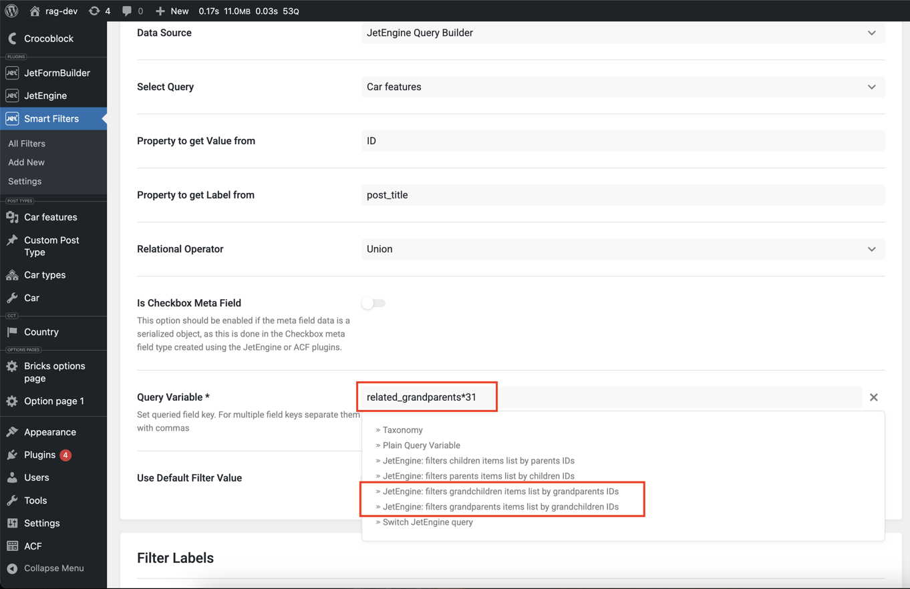

# JetEngine Relations Extended Addon

This addon extends the default JetEngine Relations module, allowing you to filter listings not only by parent and child related items, but also by grandchildren and grandparents.

It integrates directly with JetSmartFilters dynamic queries, providing support for nested relations filtering.

## 📖 How It Works

In JetSmartFilters, to filter listings by related items you use query variable keys like:

- `related_children*12`
- `related_parents*31`

Where `12` and `31` are the relation IDs.

This addon adds two new query types:

- `related_grandchildren*12`
- `related_grandparents*31`

**The logic is exactly the same** as for parents and children — but allows you to fetch grandchildren or grandparents in multi-level relations.

## 📄 Documentation

> 🔗 JetEngine documentation already covers how to work with `related_children` and `related_parents` filters in both the old and new UI.
>
> You can follow those guides — the only difference is the query type:
>
> - Replace `related_children` with `related_grandchildren`
> - Replace `related_parents` with `related_grandparents`

**Documentation:**

- [Relations Filtering (Old UI)](https://crocoblock.com/knowledge-base/jetengine/jetengine-how-to-filter-related-post-items/)
- [Relations Filtering (New UI)](https://crocoblock.com/knowledge-base/jetsmartfilters/how-to-set-query-variable-in-filters/)

The configuration process for grandchildren and grandparents works the same way.

## 📸 Screenshots

## 📌 Requirements

- JetEngine v3.7.3+

## 📥 Installation

1. Upload the plugin to your `/wp-content/plugins/` directory.
2. Activate it via WordPress Plugins menu.
3. Create relations as usual via JetEngine.
4. Use new query variable types (`related_grandchildren*ID`, `related_grandparents*ID`) in your JetSmartFilters.

---

## 📌 Summary

If you already work with `related_children` and `related_parents` — using grandchildren and grandparents will be familiar to you.  
Just change the query type prefix — the setup and filtering logic stays the same.

